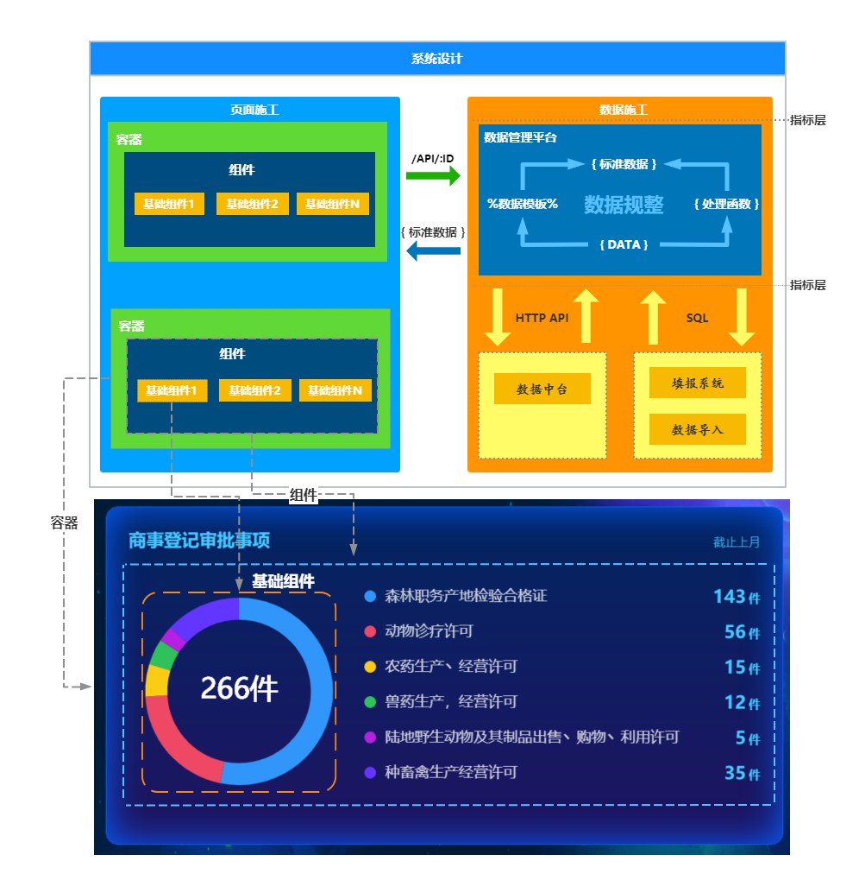
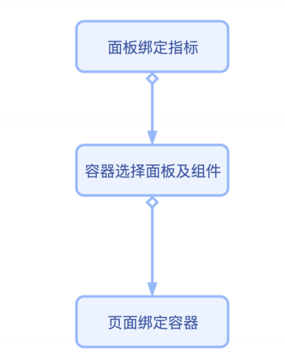
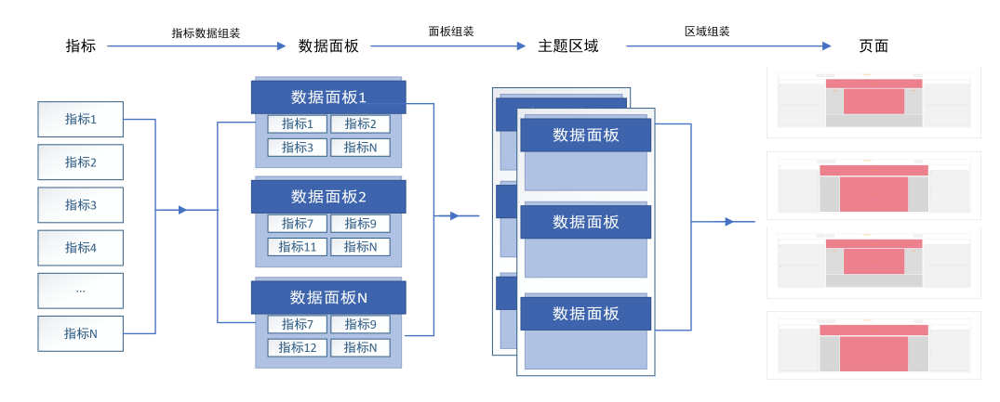
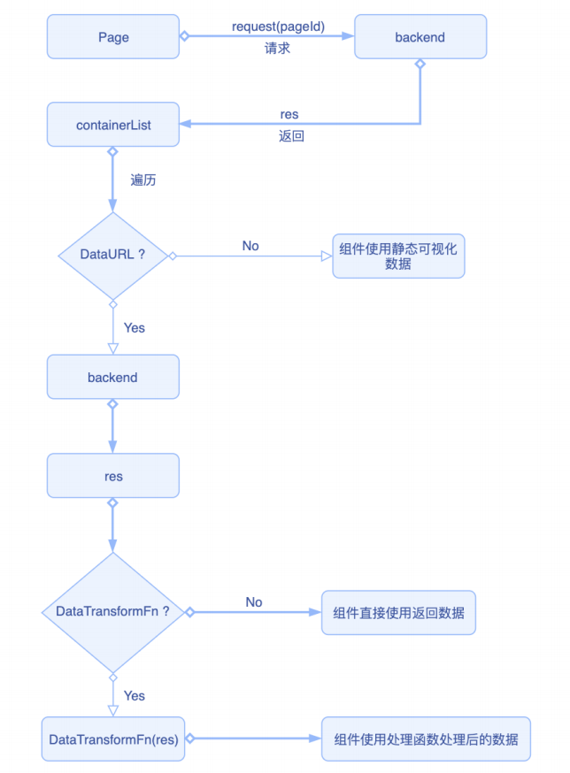

# 驾驶舱前端开发

## Project setup
```
npm install
```

### Compiles and hot-reloads for development
```
npm run serve
```

### Compiles and minifies for production
```
npm run build
```

### Run your tests
```
npm run test
```

### Lints and fixes files
```
npm run lint
```

### Customize configuration
See [Configuration Reference](https://cli.vuejs.org/config/).

# 项目结构


```
/
├── build/                  配置
├── env/                    环境变量配置
├── mock/                   模拟接口数据
├── vue-cli-plugin/         启动配置
├── src/
│   ├── assets/             资源目录，字体、图标、css、sass等
│   ├── components/         公用组件，针对各模块之间或全局可复用的组件
│   ├── icons/              资源目录, svg图标
│   ├── mixins/             模块混合，分发到组件内部文件
│   ├── services/           请求接口
│   ├── utils/              公用方法，针对复用的方法
│   └── views/              模块页面，包含各个模块及模块相关组件
├── router.js               路由
├── App.vue                 入口
└── main.js                 入口
```
## 概要图

## 施工流程




## 页面执行流程

